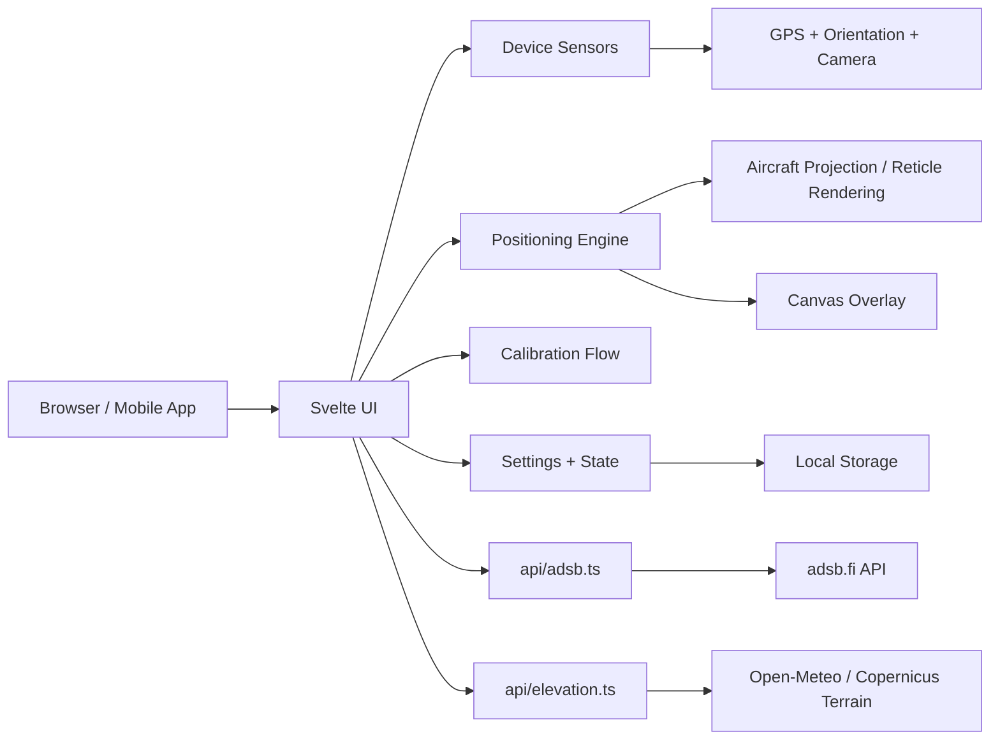

# SnapLock

SnapLock is a mobile-first aircraft spotting app that overlays live ADS-B traffic on the camera view so you can identify nearby aircraft in real time. It combines device motion, GPS, observer elevation, and live flight data to place aircraft markers in the correct direction and elevation relative to your view.

## Features

- Live aircraft overlays in the camera view with reticles and directional edge indicators
- ADS-B aircraft tracking with filter radius, distance, bearing, and vertical placement
- Sensor-aware alignment using phone motion, orientation, GPS, and calibration offsets
- Observer elevation handling with GPS fallback and optional manual override
- Calibration flow for heading and horizon alignment using aircraft, Moon, landmarks, or known bearings
- Settings panel for FOV, distance units, altitude units, and search radius
- Status panel summarizing motion, heading, GPS, ADS-B, view, calibration, and elevation state

## Quick start

### Requirements

- Node.js 20.19+ or 22.12+
- Modern mobile browser with camera, motion, and location permissions
- HTTPS in production; localhost works during development

### Install and run

```sh
npm install
npm run dev
```

Then open the local Vite URL shown in the terminal.

## Setup and permissions

1. Open the app in a supported browser on a phone or mobile emulation environment.
2. Allow camera access so the live view can open.
3. Allow location access so SnapLock can estimate your position and altitude.
4. Allow motion/orientation access so headings, pitch, and roll can be aligned to the camera.
5. If permission is denied, use the app prompt to retry after enabling it in device settings.

The app expects a portrait orientation and requires the device to be held upright for accurate projection.

## Calibrating the app

Open the Settings panel and choose Calibrate sensors.

### Calibration methods

- Automatic corrected compass heading
- Visible aircraft reference
- Moon alignment
- Landmark selection on a map
- Known true bearing entry

### Recommended calibration workflow

1. Enable camera, location, and motion permissions.
2. Wait for a stable GPS fix and valid motion readings.
3. Go to Settings > Calibrate sensors.
4. Choose a method suitable to your environment.
5. Keep the target centered while the app gathers readings.
6. Verify the heading direction if you are calibrating with two references.
7. Save the calibration when the quality is acceptable.

Calibration values are stored locally in the browser so the app can restore them on future visits.

## Using the app

1. Point the phone at the sky while holding it upright.
2. Watch for nearby aircraft markers appearing in the view.
3. Use the reticles and edge indicators to identify the aircraft direction and location.
4. Tap an aircraft in the live view for the details sheet.
5. Review distance, altitude, speed, heading, apparent elevation, and confidence in the aircraft detail panel.
6. Use Settings to adjust search radius, FOV, units, and elevation behavior.

### Status panel

The Status control in the top-left header shows a live summary of the app state. It toggles open and closed on tap and closes when you tap outside the panel.

### Observer elevation

SnapLock resolves observer elevation in this order:

- manual MSL override
- fresh GPS altitude
- cached terrain elevation
- unavailable

Use Settings > Observer elevation to inspect the source or restore automatic behavior.

## Architecture

The application is organized as a Vite Svelte app with a thin server-side API layer for ADS-B and terrain elevation proxies.



### Frontend

The main app is rendered in [src/App.svelte](src/App.svelte). It owns the live camera, overlays, settings panel, calibration flow, and aircraft selection sheet.

### Core libraries

- [src/lib/positioning.ts](src/lib/positioning.ts): geodesic math, line-of-sight placement, bearing, and dead-reckoning
- [src/lib/elevation.ts](src/lib/elevation.ts): observer elevation resolution and confidence logic
- [src/lib/sensors.ts](src/lib/sensors.ts): smoothing and sensor normalization
- [src/lib/orientation.ts](src/lib/orientation.ts): camera frame and orientation math
- [src/lib/calibration](src/lib/calibration): heading and landmark calibration flows

### API layer

The app includes same-origin server endpoints in [api](api):

- [api/adsb.ts](api/adsb.ts): proxies nearby aircraft data from adsb.fi to the browser without direct CORS access
- [api/elevation.ts](api/elevation.ts): resolves terrain elevation from a cached remote terrain provider

These APIs are required in production because browsers block direct access to the upstream data sources.

### Runtime behavior

- The live view refreshes aircraft data on a poll cadence and keeps a stale-data warning if the feed ages out.
- The positioning worker handles frame-by-frame aircraft projection off the main UI thread.
- Canvas overlays render reticles and edge arrows over the camera feed using device-pixel-ratio-aware sizing.
- Settings and calibration state are persisted in browser local storage.

## Validation

Run the following checks before release:

```sh
npm run check
npm test
npm run build
npm run preview
```

The production build output is written to the `dist/` folder.

## Deployment

This app is designed to be deployed on Vercel or any platform that supports both the front-end build and the serverless API functions.

### Vercel setup

1. Push this repository to GitHub.
2. Import it into Vercel.
3. Keep the framework preset as Vite.
4. Use `npm run build` for the build command.
5. Set the output directory to `dist`.

For camera, location, and motion APIs to work correctly, the app must be served over HTTPS.

## Data attributions

- ADS-B aircraft data: adsb.fi
- Terrain elevation: Open-Meteo / Copernicus GLO-90
- Map tiles and landmark calibration map: OpenStreetMap contributors
- Moon calculations: SunCalc

All attribution and source information remains visible in-app where relevant.
